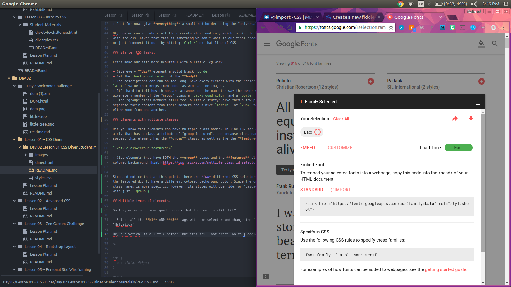

# CSS Diner Menu

Your good friend has tried to make a website for a sushi restaurant, but they ended up making a complete mess of it :persevere: .

## Instructions

Open the `diner.html` file and give it a look in the preview--it's totally unusable. Let's add some style that can make it easy to view and use.

Be sure to use your references! For each design task, you will need to find the right property and use it correctly!
<!-- + [List of CSS Properties]()
+ [List of CSS selectors]() -->

--------------

## Restyling Directions

### Initial setup.

For starters, the images are *way* too large and are preventing us from seeing any of the content.

+ Set the `max-width` of all the image elements to something much more manageable, like `400px`

Phew, much better. Even with the images sized down, however, it's hard to see where all the elements being and end.

+ Just for now, give **everything** a small red border using the "universal selector"

Ok, now we can see where all the elements start and end, which is nice to know as we experiment with the css. Given that this is something we don't want in our final product, we can delete it or just 'comment it out' by hitting `Ctrl /` on that line of CSS.

### Starter CSS Tasks.

Let's make our site more beautiful with a little leg work.

+ Give every **div** element a solid black `border`
+ Set the `background-color` of the **body**.
+ The descriptions can run on too long. Give every element with the "description" class a  `width` value that keeps them about as wide as the images.
+ It's hard to tell how things are arranged on the page the way the owner wants them to be: give every member of the "group" class a `background-color` and a `border`
+  The "group" class members still feel a little stuffy: give them a few pixels of `padding` to separate their content from their borders and a nice `margin`  of `20px` to give them some elbow room from one another.

### Elements with multiple classes

Did you know that elements can have multiple class names? In line 18, for example, you will see a div that has a class attribute of "group featured", and because class names can't have spaces, this element has the **group** class, as well as the the **featured** class.:

` 
`

+ Give elements that have BOTH the **group** class and the **featured** class a specially colored background [hint](https://css-tricks.com/multiple-class-id-selectors/)

Stop and notice that at this point, there are *two* different CSS selectors that are telling the featured div to have a different colored background color. Since the one with multiple class names is more specific, however, its styles will override, or 'cascade' over the selector with just `.group {...}`

## Multiple types of elements.

So far, we've made some good changes, but the font is still UGLY.

+ Select all the **h1** AND **h3** tags with one selector and change the `font-family` to "Helvetica".

Ok, 'Helvetica' is a little better, but it's still not great.
+ Go to [Google Fonts](https://fonts.google.com/)
+ Add a font by clicking the `+` symbol
+ follow the directions on the tab to add the font to your page

## More challenges
+ Make the `li` elements in the `nav` have `display: inline-block;` property, a special `background-color`,  `border-radius`, `padding`, and `margin-left`
+ Make the `a` elements *within* any `li` element have a special `color`, `font-weight`, and no `text-decoration`
+ Give any element with the class "item-container" that is *inside* a group a `width` of 40% and set the `display` to `inline-block`

<!-- I can keep adding more here.  -->

<!--

img {
  max-width: 400px;
}

div {
  /*border: 3px solid red;*/
}

body {
  background-color: dodgerblue;
}

img {
  border: 3px solid black;
}

p {
  max-width: 400px;
}

.group {
  background-color: red;
  padding: 50px;
  border: 10px solid black;
  margin: 50px;
}

.featured.group {
  background-color: yellow;
}

h1, h3 {
  font-family: helvetica;
}

li {
  display: inline-block;
  /*margin: auto;*/
  background-color: lightgray;
  padding: 10px;
  border-radius: 5px;
  margin-left: 20px;
}

li a {
  color: white;
  text-decoration: none;
  font-weight: bold;
}

.group .item-container{
  width: 40%;
  display: inline-block;
}
.group .item-container {
  /*vertical-align: top;*/
}

.item-container {
  height: 200px;
  overflow-y: auto;
}

/*
box shadow
Last child

*/

-->
